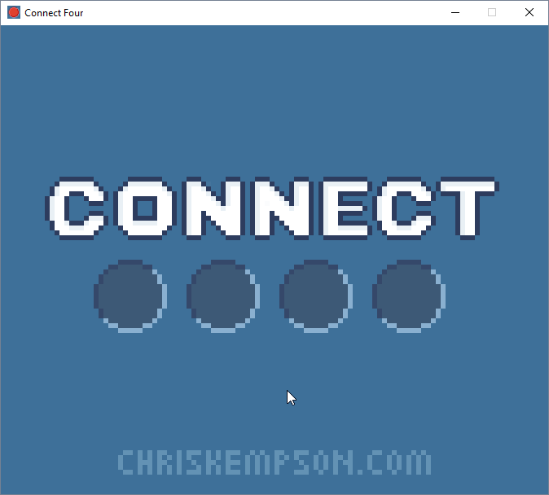

# Connect Four

## About
A game of [Connect Four](https://en.wikipedia.org/wiki/Connect_Four) created by [Chris Kempson](http://chriskempson.com/) in C++ with [Simple DirectMedia Layer version 2](https://www.libsdl.org/).

This code in this game is largely identical to my previous project [Tic-tac-toe](https://github.com/chriskempson/cpp-tic-tac-toe) due to the similarity of the two games and the fact that I had Connect Four in mind when I was building Tic-tac-toe as the next project I'd like to complete. 

## How to Play
This is a two player game. Clicking the mouse on the title screen will advance to the play screen. To place a piece on the grid click the mouse in the desired grid area. Once a win or draw message is display, clicking again will return to the title screen.

## Compiling

### Windows (Visual Studio)
Download [SDL2-devel-2.0.4-VC.zip](https://www.libsdl.org/release/SDL2-devel-2.0.4-VC.zip) and [SDL2_mixer-devel-2.0.1-VC.zip](https://www.libsdl.org/projects/SDL_mixer/release/SDL2_mixer-devel-2.0.1-VC.zip) and extract both to a location on your computer you'll use for storing libraries.

Setup an environment variable called `CPP_LIBS` and enter the location where you extracted SDL2 and SDL2_mixer.

Finally, copy `SDL.dll` from `SDL2-2.0.4\lib\x86` and from `SDL2_mixer-2.0.1\lib\x86` to the `Debug` and/or `Release` folders (created after you try to compile a debug or release version respectively.

## Assets
All sounds were created with [DefleMask Tracker](http://deflemask.com/) using Nintendo Game boy sound chip emulation. All images were created with the venerable [Microsoft Paint](https://en.wikipedia.org/wiki/Microsoft_Paint).

## Change Log
Please see [CHANGELOG.md](CHANGELOG.md).

## Licences
Please see [LICENCE.md](LICENCE.md).